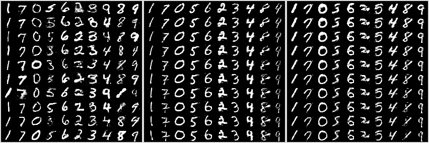
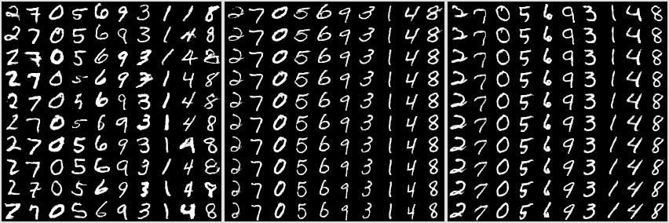
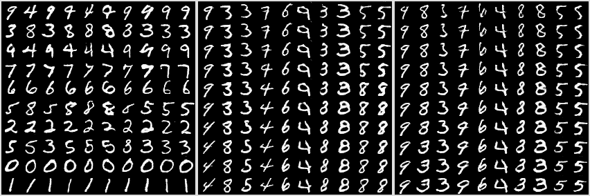

## Introduction

Target of this study was to implement
[InfoGAN](https://arxiv.org/abs/1606.03657) with
[WGAN-GP](https://arxiv.org/abs/1704.00028) loss. 

 In original InfoGAN architecture Q-network and discriminator share
most of their weights. However in WGAN-GP architecture discriminator
(in original article is called critic) is a Lipschitz constrained
function. This restriction might be not desirable for Q network. Also
discriminator in WGAN-GP should be updated several times before one
update of generator.
Because of it, we decided to make Q network completely
independent. However, possibility to share weight of Q and discriminator should
be studied in the future.

In the case, then Q is independent network, there are two ways how to
make updated of Q and G  (discriminator is updated independently
in "critic" loop).

1. Update G and Q together using combination of G_loss and Q_loss
(as in original InfoGAN article).
    * G, Q  <---  Optimizer(G_loss + lambda * Q_loss)

2. Make two updates. With Q_loss we update both G and D networks.
    * G   <--- Optimizer(G_loss)
    * Q,G <--- Optimizer(Q_loss)

In the second algorithm we update Generator's weights two times. This might
potentially destabilize Optimizers (for example momentum). 
But in the first algorithm we need to choose parameter lambda. But in the
case of WGAN-GP G_loss is potentially unlimited, so it is not clear
how to choose this parameter. 

In the following experiments we use the second algorithm. 

## Expirements on MNIST

 Both experiments have 1 ten-dimensional categorical and 2 uniform
latent codes as in original InfoGAN article.

For each experiment we show figures with three panels: three panels of
samples.  On all panels each column correspond to the fixed
categorical latent code. On the first column all other codes are
random. On the second panel we fix all other codes (including noise
variable), but we vary first uniform latent code. On the third panel we vary
the second uniform latent code.

* 08_cat10_U2_sepQ_v2_lr1e-3
    * All networks have have two fully connected hidden layers with 1024 units each.
    * 116 noise variables
   
   

* 10_originfo_sepQ_v2_lr1e-3
    * Architecture of MNIST test from Info-GAN article
    (see [table 1](https://arxiv.org/pdf/1606.03657.pdf)). 
     But we remove all batch-normalization layers (see remarks)
 

As you can see all works as expected. 

For comparison we show similar images from original [InfoGAN
code](https://github.com/openai/InfoGAN). First panel is "transposed". 

### Important Remarks

* Batch Normalization cannot be used in discriminator (see WGAN-GP 
article). However you can use another types of normalization such
layer normalization.
