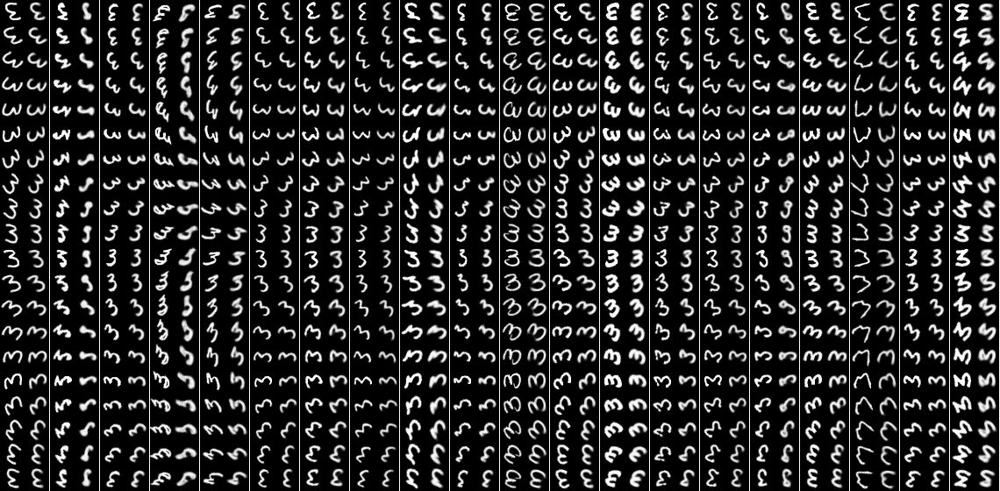
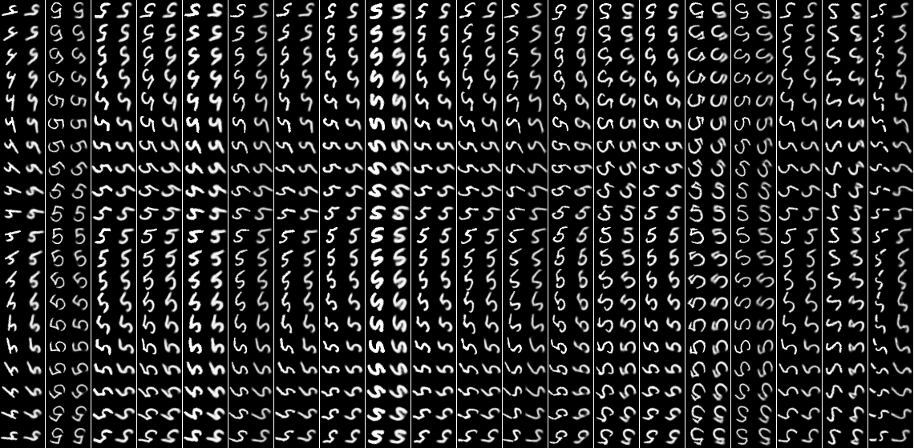
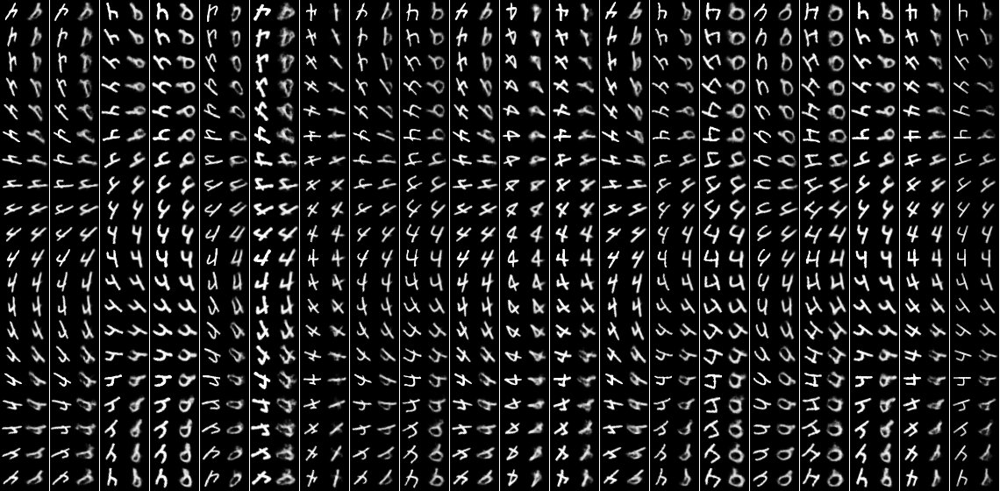
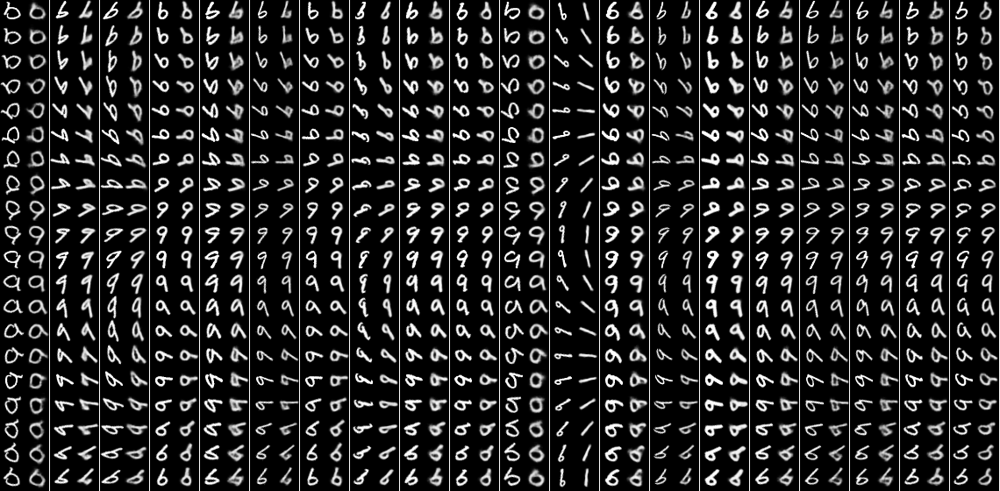
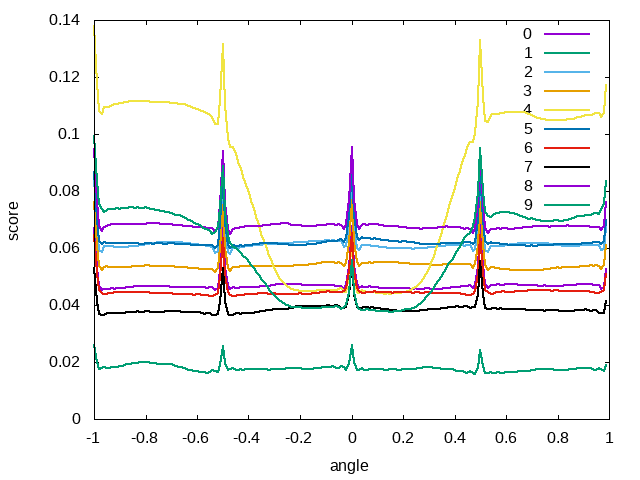

## Introduction

The general motivation of this test was to study the ability of different
models to generalize outside the scope of their training set. 

### 4,9 Test for rotation  (rotate49 experiment)

We took usual autoencoder (with or without adversarial regularization similar to adversarial autoencoders (AAE)) with an angle explicitly added to the latent code. During the training process, the model takes an image as inputs, and the same image rotated by the angle phi as target. This angle is added to the latent coded, just before decoder (after AAE regularization).
We found that the best way to represent the input angle to the model is by the pair of values: cos(phi) and sin(phi). These two numbers were concatenated with latent code representation of the input (non-rotated) image. Thus we calculated reconstruction loss between model output and the target rotated image. We expected that the encoder will learn reasonable features, and decoder will learn how to reconstruct rotated images. 

We tested the ability of this model to "generalize" the concept of rotation.

We conducted the following experiment. We trained the model on the MNIST dataset. For all digits except 4 and 9 we gave all possible angles of rotation, but for 4 and 9 we gave angles only from -45 - 45 interval. We wanted to see the behaviour of the models for 4 and 9 outside the training set.

First, let's check reconstructed images of the test set for different digits and angles. Let's compare images for 3, 5 and 4, 9. Each odd column (enumerated from 1 left to right) corresponds to the input image rotated by the given angle, each even column shows its reconstruction. Angle vary from -180 to 180.

(other plots can be found here [models/19_mnist_conv_rotate_sc_49test/test_plots2/](models/19_mnist_conv_rotate_sc_49test/test_plots2/))

As it can be seen, the network visibly fails with digit-4 outside the training region. With digit-9 the situation is not so clear.

We also can compare reconstruction loss for the test set for different digits and different angles.

Peaks on 0 and +-90 should be ignored, because they are connected to biliear blurring of images for all angles differ from 0
and +-90. 
As it can be seen, reconstruction loss for digit-4 and digit-9 increases outside the training region. 

### 4,9 test for shift (shift49 experiment)

Similar to previous experiment with rotation, we took a usual autoencoder (with or without AAE-regularization) with dx and dy shifts added  to the latent code. During the training process, the model takes an original image, dx and dy which represent shifts in pixels as inputs, and the image shifted by dx and dy as target. dx and dy are concatenated wih the latent coded, just before decoder (after AAE regularization).

We conducted the following experiment. We trained the model on the MNIST dataset. For all digits except 4 and 9 we used all possible shifts inside (-20,20), but for 4 and 9 we used only shifts from -5:5 interval. We wanted to see behavior of the models for 4 and 9 outside the training set.

We should note that due to the shift the final image has a size 68x68 (28 + 20*2).

First, let's check reconstruction plots for the test set for digit-4.

Each row corresponds to the given diagonal shift (dx=dy). Shifts vary from -20 to 20. Each odd column corresponds to the input image shifted by the given dx,dy, each even column corresponds to its reconstruction. 

x09_shift49n_54_moremaps_saa

### Conclusion

It is clear that usual convolutional networks tend more to "memorize" than generalize. It fails to "rotate" 4-like digits, because it has never seen something like this. However it managed to rotate "9" digit more or less successfully, probably because it has seen digit-6. But it should be noted that, even for digit "4" the model hasn't failed entirely, and one could argue that results are reasonably good. Models also fail to shift digit-4.
