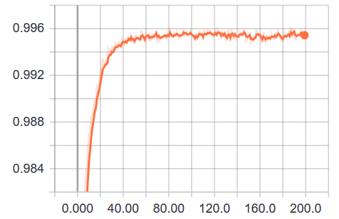
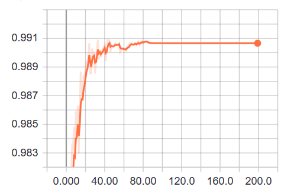
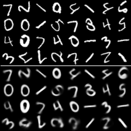
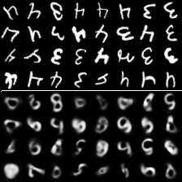
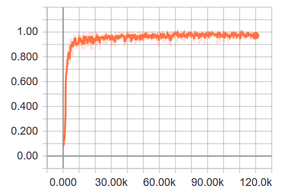

## Experiments with CapsNet training on the rotated MNIST dataset

The goal of our experiment was to evaluate CapsNet rotation generalization ability. We trained models in supervised manner on the MNIST dataset with the following restrictions: 
- Images of 6 and 9 are preliminary excluded from the training and test sets;
- Images of 3 and 4 are rotated by a random angle from the range [-45, 45] at each training iteration;
- Images of the other classes are rotated by a random angle from the full range [0, 360) at each training iteration.

Scripts with evaluated models are in the [models](./models) directory.

### Results for CapsNet with dynamic routing

Original implementation of CapsNet with dynamic routing based on the paper [Sara Sabour, Nicholas Frosst, Geoffrey E Hinton. Dynamic Routing Between Capsules. NIPS 2017](https://arxiv.org/abs/1710.09829) was taken from [here](https://github.com/XifengGuo/CapsNet-Keras)

Model parameters:

Capsules dimentionality in the last layer - 16

Routing iterations number - 3

Number of classes (capsules) in the last layer - 8

Some learning statistics:

* Training batch accuracy



* Test batch accuracy (within the training range of rotation angles)



Since rotation angle is random, below we give average test accuracy results for 100 runs.

* Mean test accuracy for the whole test set within the training range (i.e. [-45, 45] for 3 and 4, and [0, 360) for the others) - 0.991

An example of the trained decoder output (input images are in the upper half, decoded images are in the lower half):



* Mean test accuracy for 3 and 4 with rotation within the training range [-45, 45] - 0.996

An example of the trained decoder output for an image of 3 (the upper image is an initial image, the middle image is the decoder input, the lower image is the decoder output):


* Mean test accuracy for 3 and 4 with rotation outside the training range, i.e. within the range (45, 315) - 0.249

An example of the trained decoder output for an image of 3 (the upper image is an initial image, the middle image is the decoder input, the lower image is the decoder output):


* Mean test accuracy for 3 and 4 with rotation outside the training range but within the specified range (180-45, 180+45) - 0.009 

An example of the trained decoder output for a batch of 3 and 4 within the range (180-45, 180+45) (input images are in the upper half, decoded images are in the lower half):




### Results for CapsNet with EM-routing

Original implementation of CapsNet with EM routing based on the paper [G.E.Hinton, S.Sabour, N.Frosst Matrix capsules with EM routing. ICLR 2018](https://openreview.net/pdf?id=HJWLfGWRb) was taken from [here](https://github.com/www0wwwjs1/Matrix-Capsules-EM-Tensorflow) .

It's shown that the best current accuracy (0.993) on the initial MNIST is achieved with the following model parameters:

Number of channels in output from Conv1: A = 32

Number of capsules in output from PrimaryCaps: B = 8

Number of capsules in output from ConvCaps1: C = 16

Number of capsules in output from ConvCaps2: D = 16

Batch size: 50

Number of EM-routing iterations: 2

Using theese settings we trained model on the rotated MNIST. Below are some training statistcs and results of testing (for 100 runs).

* Training batch accuracy



An example of the trained decoder output (input images are in the upper half, decoded images are in the lower half):


* Mean test accuracy for the whole test set within the training range (i.e. [-45, 45] for 3 and 4, and [0, 360) for the others) - 0.976

* Mean test accuracy for 3 and 4 with rotation within the training range [-45, 45] -  0.989

* Mean test accuracy for 3 and 4 with rotation outside the training range, i.e. within the range (45, 315) - 0.218

* Mean test accuracy for 3 and 4 with rotation outside the training range but within the specified range (180-45, 180+45) - 0.089 


## Baseline model results

Models were trained for 300 epochs

### Regular CNN

#### Regular CNN Model 00:

```
def model(x, reuse = True):
    with tf.variable_scope('Basenet', reuse=reuse):
        x = tf.identity(x, name="input")
        x = tf.layers.conv2d(x, 64, 4, 2, padding='same', activation=lrelu, name='conv1')

        x = tf.layers.conv2d(x, 128, 4, 2, padding='same', activation=lrelu, name='conv2')

        x = tf.contrib.layers.flatten(x)
        x = tf.layers.dense(x, 1024, activation=lrelu, name='fc')

        x = tf.layers.dense(x, NCLASSES, activation=None, name='fc_out')
        x = tf.identity(x, name="activation_none")
        x = tf.nn.softmax(x, name="activation_softmax")
        x = tf.identity(x, name="output")
        return x
```

* The whole test set within the training range:

  Mean test accuracy for 1000 runs: 0.9887393252832016                                                                 
  
  Variance of test accuracy for 1000 runs: 4.25794807052056e-07


* 3 and 4 sequence within the training range [-45, 45]

  Mean test accuracy for 1000 runs: 0.9912660642570387                                                                 
  
  Variance of test accuracy for 1000 runs: 1.5442281172884628e-06

* 3 and 4 sequence outside the training range (45, 315):
  
  Mean test accuracy for 1000 runs: 0.2118253012048205   
  
  Variance of test accuracy for 1000 runs: 8.763670747246009e-05 

* 3 and 4 sequence outside the training range (180+-45):

  Mean test accuracy for 1000 runs: 0.0030552208835341326      
  
  Variance of test accuracy for 1000 runs: 7.667729149529905e-07 


#### Regular CNN Model 01:

```
def model(x, reuse = True):
    with tf.variable_scope('Basenet', reuse=reuse):
        x = tf.identity(x, name="input")
        x = tf.layers.conv2d(x, 64, 4, 2, padding='same', activation=lrelu, name='conv1')

        x = tf.layers.conv2d(x, 128, 4, 2, padding='same', activation=lrelu, name='conv2')

        x = tf.layers.conv2d(x, 256, 4, 2, padding='same', activation=lrelu, name='conv3')

        x = tf.contrib.layers.flatten(x)
        x = tf.layers.dense(x, 1024, activation=lrelu, name='fc')

        x = tf.layers.dense(x, NCLASSES, activation=None, name='fc_out')
        x = tf.identity(x, name="activation_none")
        x = tf.nn.softmax(x, name="activation_softmax")
        x = tf.identity(x, name="output")
        return x
```

* The whole test set within the training range:

  Mean test accuracy for 1000 runs: 0.9904103074816323                                                                                                  
  
  Variance of test accuracy for 1000 runs: 4.1331505547831157e-07


* 3 and 4 sequence within the training range [-45, 45]
  
  Mean test accuracy for 1000 runs: 0.9938097389558349                                                                                      
  
  Variance of test accuracy for 1000 runs: 1.5824943851712192e-06

* 3 and 4 sequence outside the training range (45, 315):
    
  Mean test accuracy for 1000 runs: 0.2329156626505997                                                                                      
  
  Variance of test accuracy for 1000 runs: 8.483708327285044e-05

* 3 and 4 sequence outside the training range (180+-45):
  
  Mean test accuracy for 1000 runs: 0.007554718875502008                                                                                    
  
  Variance of test accuracy for 1000 runs: 1.7818762499798343e-06


#### Regular CNN Model 02:

```
def model(x, reuse = True):
    with tf.variable_scope('Basenet', reuse=reuse):
        x = tf.identity(x, name="input")
        x = tf.layers.conv2d(x, 32, 4, 2, padding='same', activation=lrelu, name='conv1')
        x = tf.layers.conv2d(x, 64, 4, 2, padding='same', activation=lrelu, name='conv2')		
        x = tf.layers.conv2d(x, 128, 4, 2, padding='same', activation=lrelu, name='conv3')

        x = tf.layers.conv2d(x, 256, 4, 2, padding='same', activation=lrelu, name='conv4')

        x = tf.contrib.layers.flatten(x)
        x = tf.layers.dense(x, 1024, activation=lrelu, name='fc')

        x = tf.layers.dense(x, NCLASSES, activation=None, name='fc_out')
        x = tf.identity(x, name="activation_none")
        x = tf.nn.softmax(x, name="activation_softmax")
        x = tf.identity(x, name="output")
        return x
```

* The whole test set within the training range:

  Mean test accuracy for 1000 runs: 0.9908211129092452                                                                 
  
  Variance of test accuracy for 1000 runs: 4.069675305659398e-07


* 3 and 4 sequence within the training range [-45, 45]
  
  Mean test accuracy for 1000 runs: 0.9947058232931845                                                                 
  
  Variance of test accuracy for 1000 runs: 1.2776719327107308e-06

* 3 and 4 sequence outside the training range (45, 315):

  Mean test accuracy for 1000 runs: 0.2450577309236937                                                                
  
  Variance of test accuracy for 1000 runs: 8.934305873090751e-05

* 3 and 4 sequence outside the training range (180+-45):
  
  Mean test accuracy for 1000 runs: 0.0018077309236947962                                                              
  
  Variance of test accuracy for 1000 runs: 6.511485197819354e-07


### CNN with droput layer

#### CNN with dropout Model 00:

```
def model(x, phase_train, keep_prob, reuse = True):
    with tf.variable_scope('Basenet', reuse=reuse):
        x = tf.identity(x, name="input")
        x = tf.layers.conv2d(x, 32, 4, 2, padding='same', activation=lrelu, name='conv1')

        x = tf.layers.conv2d(x, 64, 4, 2, padding='same', activation=lrelu, name='conv2')

        x = tf.layers.conv2d(x, 128, 4, 2, padding='same', activation=lrelu, name='conv3')

        x = tf.contrib.layers.flatten(x)
        x = tf.layers.dense(x, 1024, activation=lrelu, name='fc')
        x = tf.nn.dropout(x, keep_prob=keep_prob)
        x = tf.layers.dense(x, NCLASSES, activation=None, name='fc_out')
        x = tf.identity(x, name="activation_none")
        x = tf.nn.softmax(x, name="activation_softmax")
        x = tf.identity(x, name="output")
        return x
```

* The whole test set within the training range:

  Mean test accuracy for 1000 runs: 0.9925333001369322
  
  Variance of test accuracy for 1000 runs: 3.310692949655573e-07


* 3 and 4 set within the training range [-45, 45]:

  Mean test accuracy for 1000 runs: 0.9928453815261152
  
  Variance of test accuracy for 1000 runs: 1.469355332978527e-06


* 3 and 4 set outside the training range (45, 315):
  
  Mean test accuracy for 1000 runs: 0.2398273092369457
  
  Variance of test accuracy for 1000 runs: 8.001239496137148e-05

* 3 and 4 set outside the training range (180+-45):
  
  Mean test accuracy for 1000 runs: 0.038917168674698716
  
  Variance of test accuracy for 1000 runs: 1.1268646372639197e-06


#### CNN with dropout Model 01:  

```  
def model(x, phase_train, keep_prob, reuse = True):
    with tf.variable_scope('Basenet', reuse=reuse):
        x = tf.identity(x, name="input")
        x = tf.layers.conv2d(x, 64, 4, 2, padding='same', activation=lrelu, name='conv1')

        x = tf.layers.conv2d(x, 128, 4, 2, padding='same', activation=lrelu, name='conv2')

        x = tf.layers.conv2d(x, 256, 4, 2, padding='same', activation=lrelu, name='conv3')

        x = tf.contrib.layers.flatten(x)
        x = tf.layers.dense(x, 1024, activation=lrelu, name='fc')
        x = tf.nn.dropout(x, keep_prob=keep_prob)
        x = tf.layers.dense(x, NCLASSES, activation=None, name='fc_out')
        x = tf.identity(x, name="activation_none")
        x = tf.nn.softmax(x, name="activation_softmax")
        x = tf.identity(x, name="output")
        return x
```

* The whole test set within the training range:
  
  Mean test accuracy for 1000 runs: 0.9905875762479722
  
  Variance of test accuracy for 1000 runs: 3.4728368782643147e-07

* 3 and 4 set within the training range [-45, 45]:
  
  Mean test accuracy for 1000 runs: 0.99468373493977
  
  Variance of test accuracy for 1000 runs: 1.320518015838422e-06


* 3 and 4 set outside the training range (45, 315):
  
  Mean test accuracy for 1000 runs: 0.2501576305220884
  
  Variance of test accuracy for 1000 runs: 8.139974657666813e-05

* 3 and 4 set outside the training range (180+-45):

  Mean test accuracy for 1000 runs: 0.03763152610441772
  
  Variance of test accuracy for 1000 runs: 6.765404993467924e-07
  
  
### CNN with batch normalization 

#### CNN with batch normalization Model 00:

```
 def model(x, phase_train, keep_prob, reuse = True):
    with tf.variable_scope('Basenet', reuse=reuse):
        x = tf.identity(x, name="input")
        x = tf.layers.conv2d(x, 64, 4, 2, padding='same', activation=lrelu, name='conv1')
        x = tf.contrib.layers.batch_norm(x,
                                         center=True, scale=True,
                                         is_training=phase_train,
                                         scope='bn1')
        x = tf.layers.conv2d(x, 128, 4, 2, padding='same', activation=lrelu, name='conv2')
        x = tf.contrib.layers.batch_norm(x,
                                         center=True, scale=True,
                                         is_training=phase_train,
                                         scope='bn2')
        x = tf.contrib.layers.flatten(x)
        x = tf.layers.dense(x, 1024, activation=lrelu, name='fc')

        x = tf.nn.dropout(x, keep_prob=keep_prob)
        x = tf.layers.dense(x, NCLASSES, activation=None, name='fc_out')
        x = tf.identity(x, name="activation_none")
        x = tf.nn.softmax(x, name="activation_softmax")
        x = tf.identity(x, name="output")
        return x
```

* The whole test set within the training range:
  
  Mean test accuracy for 1000 runs: 0.9928328146396076
  
  Variance of test accuracy for 1000 runs: 2.876303429605206e-07


* 3 and 4 sequence within the training range [-45, 45]
  
  Mean test accuracy for 1000 runs: 0.9963609437751118
  
  Variance of test accuracy for 1000 runs: 7.935857385364334e-07

* 3 and 4 sequence outside the training range (45, 315):
  
  Mean test accuracy for 1000 runs: 0.25672439759036325
  
  Variance of test accuracy for 1000 runs: 8.280132956524897e-05

* 3 and 4 sequence outside the training range (180+-45):
  
  Mean test accuracy for 1000 runs: 0.040645080321284936
  
  Variance of test accuracy for 1000 runs: 1.3698808789374259e-06

  
#### CNN with batch normalization Model 01:

```
def model(x, phase_train, keep_prob, reuse = True):
    with tf.variable_scope('Basenet', reuse=reuse):
        x = tf.identity(x, name="input")
        x = tf.layers.conv2d(x, 32, 4, 2, padding='same', activation=lrelu, name='conv1')
        x = tf.contrib.layers.batch_norm(x,
                                         center=True, scale=True,
                                         is_training=phase_train,
                                         scope='bn1')
        x = tf.layers.conv2d(x, 64, 4, 2, padding='same', activation=lrelu, name='conv2')
        x = tf.contrib.layers.batch_norm(x,
                                         center=True, scale=True,
                                         is_training=phase_train,
                                         scope='bn2')
        x = tf.layers.conv2d(x, 128, 4, 2, padding='same', activation=lrelu, name='conv3')
        x = tf.contrib.layers.batch_norm(x,
                                         center=True, scale=True,
                                         is_training=phase_train,
                                         scope='bn3')
        x = tf.contrib.layers.flatten(x)
        x = tf.layers.dense(x, 1024, activation=lrelu, name='fc')

        x = tf.nn.dropout(x, keep_prob=keep_prob)
        x = tf.layers.dense(x, NCLASSES, activation=None, name='fc_out')
        x = tf.identity(x, name="activation_none")
        x = tf.nn.softmax(x, name="activation_softmax")
        x = tf.identity(x, name="output")
        return x

```

* The whole test set within the training range:
  
  Mean test accuracy for 1000 runs: 0.9925333001369322
  
  Variance of test accuracy for 1000 runs: 3.310692949655573e-07

* 3 and 4 set within the training range [-45, 45]:
  
  Mean test accuracy for 1000 runs: 0.9962474899598518
  
  Variance of test accuracy for 1000 runs: 9.080939722745921e-07

* 3 and 4 set outside the training range (45, 315):
  
  Mean test accuracy for 1000 runs: 0.26722941767068614
  
  Variance of test accuracy for 1000 runs: 8.551373138134867e-05

* 3 and 4 set outside the training range (180+-45):
  
  Mean test accuracy for 1000 runs: 0.0379126506024097
  
  Variance of test accuracy for 1000 runs: 6.76278406799895e-07


#### CNN with batch normalization Model 02:

```
def model(x, phase_train, keep_prob, reuse = True):
    with tf.variable_scope('Basenet', reuse=reuse):
        x = tf.identity(x, name="input")
        x = tf.layers.conv2d(x, 64, 4, 2, padding='same', activation=lrelu, name='conv1')
        x = tf.contrib.layers.batch_norm(x,
                                         center=True, scale=True,
                                         is_training=phase_train,
                                         scope='bn1')
        x = tf.layers.conv2d(x, 128, 4, 2, padding='same', activation=lrelu, name='conv2')
        x = tf.contrib.layers.batch_norm(x,
                                         center=True, scale=True,
                                         is_training=phase_train,
                                         scope='bn2')
        x = tf.layers.conv2d(x, 256, 4, 2, padding='same', activation=lrelu, name='conv3')
        x = tf.contrib.layers.batch_norm(x,
                                         center=True, scale=True,
                                         is_training=phase_train,
                                         scope='bn3')
        x = tf.contrib.layers.flatten(x)
        x = tf.layers.dense(x, 1024, activation=lrelu, name='fc')
        x = tf.nn.dropout(x, keep_prob=keep_prob)
        x = tf.layers.dense(x, NCLASSES, activation=None, name='fc_out')
        x = tf.identity(x, name="activation_none")
        x = tf.nn.softmax(x, name="activation_softmax")
        x = tf.identity(x, name="output")
        return x
```
		
* The whole test set within the training range:
  
  Mean test accuracy for 1000 runs: 0.9935903149508223
  
  Variance of test accuracy for 1000 runs: 3.1247735420532485e-07

* 3 and 4 set within the training range [-45, 45]:
  
  Mean test accuracy for 1000 runs: 0.9968940763052335
  
  Variance of test accuracy for 1000 runs: 7.298347506491675e-07

* 3 and 4 set outside the training range (45, 315):
  
  Mean test accuracy for 1000 runs: 0.270038654618477
  
  Variance of test accuracy for 1000 runs: 8.832924846978271e-05

* 3 and 4 set outside the training range (180+-45):
  
  Mean test accuracy for 1000 runs: 0.03739859437751003
  
  Variance of test accuracy for 1000 runs: 4.894064208641848e-07

 
### CNN with max pooling

#### CNN with max pooling Model 00: 

```
def model(x, phase_train, keep_prob, reuse = True):
    with tf.variable_scope('Basenet', reuse=reuse):
        x = tf.identity(x, name="input")
        x = tf.layers.conv2d(x, 64, 5, 1, padding='same', activation=lrelu, name='conv1')
        x = tf.contrib.layers.batch_norm(x,
                                         center=True, scale=True,
                                         is_training=phase_train,
                                         scope='bn1')

        x = tf.layers.max_pooling2d(x, pool_size=2, strides = 1, padding='same', name='pooling1')

        x = tf.layers.conv2d(x, 128, 5, 1, padding='same', activation=lrelu, name='conv2')
        x = tf.contrib.layers.batch_norm(x,
                                         center=True, scale=True,
                                         is_training=phase_train,
                                         scope='bn2')

        x = tf.layers.max_pooling2d(x, pool_size=2, strides=1, padding='same', name='pooling1')

        x = tf.contrib.layers.flatten(x)
        x = tf.layers.dense(x, 1024, activation=lrelu, name='fc')

        x = tf.nn.dropout(x, keep_prob=keep_prob)
        x = tf.layers.dense(x, NCLASSES, activation=None, name='fc_out')
        x = tf.identity(x, name="activation_none")
        x = tf.nn.softmax(x, name="activation_softmax")
        x = tf.identity(x, name="output")
        return x
```

* The whole test set within the training range:
  
  Mean test accuracy for 1000 runs: 0.9857337233910121
  
  Variance of test accuracy for 1000 runs: 7.13597537383492e-07 

* 3 and 4 set within the training range [-45, 45]:
                                                                                                      
  Mean test accuracy for 1000 runs: 0.994850401606437                                                                  
  
  Variance of test accuracy for 1000 runs: 1.3128407203109266e-06 

* 3 and 4 set outside the training range (45, 315):                                                                                                     
  
  Mean test accuracy for 1000 runs: 0.25210592369477974                                                                
  
  Variance of test accuracy for 1000 runs: 8.15241324232673e-05 

* 3 and 4 set outside the training range (180+-45):                                                                                                   
  
  Mean test accuracy for 1000 runs: 0.04563353413654585                                                                
  
  Variance of test accuracy for 1000 runs: 2.3775816115869085e-06  


#### CNN with max pooling Model 01:

```
def model(x, phase_train, keep_prob, reuse = True):
    with tf.variable_scope('Basenet', reuse=reuse):
        x = tf.identity(x, name="input")
        x = tf.layers.conv2d(x, 32, 5, 1, padding='same', activation=lrelu, name='conv1')
        x = tf.contrib.layers.batch_norm(x,
                                         center=True, scale=True,
                                         is_training=phase_train,
                                         scope='bn1')

        x = tf.layers.max_pooling2d(x, pool_size=2, strides = 1, padding='same', name='pooling1')

        x = tf.layers.conv2d(x, 64, 5, 1, padding='same', activation=lrelu, name='conv2')
        x = tf.contrib.layers.batch_norm(x,
                                         center=True, scale=True,
                                         is_training=phase_train,
                                         scope='bn2')

        x = tf.layers.max_pooling2d(x, pool_size=2, strides=1, padding='same', name='pooling1')

        x = tf.layers.conv2d(x, 128, 3, 1, padding='same', activation=lrelu, name='conv3')
        x = tf.contrib.layers.batch_norm(x,
                                         center=True, scale=True,
                                         is_training=phase_train,
                                         scope='bn3')

        x = tf.contrib.layers.flatten(x)
        x = tf.layers.dense(x, 1024, activation=lrelu, name='fc')

        x = tf.nn.dropout(x, keep_prob=keep_prob)
        x = tf.layers.dense(x, NCLASSES, activation=None, name='fc_out')
        x = tf.identity(x, name="activation_none")
        x = tf.nn.softmax(x, name="activation_softmax")
        x = tf.identity(x, name="output")
        return x
```

* The whole test set within the training range:                                                                                                    
  
  Mean test accuracy for 1000 runs: 0.9894174032117462                                                                 
  
  Variance of test accuracy for 1000 runs: 4.4934618556291175e-07  
  
* 3 and 4 set within the training range [-45, 45]:                                                                                                   
  
  Mean test accuracy for 1000 runs: 0.9971646586345513                                                                 
  
  Variance of test accuracy for 1000 runs: 7.716851341107328e-07  

* 3 and 4 set outside the training range (45, 315):
  
  Mean test accuracy for 1000 runs: 0.2500988955823294                                                                 
  
  Variance of test accuracy for 1000 runs: 8.328600319954522e-05  

* 3 and 4 set outside the training range (180+-45):                                                                                                     
  
  Mean test accuracy for 1000 runs: 0.04311144578313203                                                                
  
  Variance of test accuracy for 1000 runs: 1.6181986984080907e-06  

  
#### CNN with max pooling Model 02:

```
def model(x, phase_train, keep_prob, reuse = True):
    with tf.variable_scope('Basenet', reuse=reuse):
        x = tf.identity(x, name="input")
        x = tf.layers.conv2d(x, 64, 5, 1, padding='same', activation=lrelu, name='conv1')
        x = tf.contrib.layers.batch_norm(x,
                                         center=True, scale=True,
                                         is_training=phase_train,
                                         scope='bn1')

        x = tf.layers.max_pooling2d(x, pool_size=2, strides = 1, padding='same', name='pooling1')

        x = tf.layers.conv2d(x, 128, 5, 1, padding='same', activation=lrelu, name='conv2')
        x = tf.contrib.layers.batch_norm(x,
                                         center=True, scale=True,
                                         is_training=phase_train,
                                         scope='bn2')

        x = tf.layers.max_pooling2d(x, pool_size=2, strides=1, padding='same', name='pooling1')

        x = tf.layers.conv2d(x, 256, 4, 2, padding='same', activation=lrelu, name='conv3')
        x = tf.contrib.layers.batch_norm(x,
                                         center=True, scale=True,
                                         is_training=phase_train,
                                         scope='bn3')

        x = tf.contrib.layers.flatten(x)
        x = tf.layers.dense(x, 1024, activation=lrelu, name='fc')

        x = tf.nn.dropout(x, keep_prob=keep_prob)
        x = tf.layers.dense(x, NCLASSES, activation=None, name='fc_out')
        x = tf.identity(x, name="activation_none")
        x = tf.nn.softmax(x, name="activation_softmax")
        x = tf.identity(x, name="output")
        return x
```
		
* The whole test set within the training range:                                                                                             
  
  Mean test accuracy for 1000 runs: 0.9927374579858049                                                                 
  
  Variance of test accuracy for 1000 runs: 3.245729999380551e-07 

* 3 and 4 set within the training range [-45, 45]:                                                                                                    
  
  Mean test accuracy for 1000 runs: 0.9978760040160773                                                                 
  
  Variance of test accuracy for 1000 runs: 4.182490504185496e-07   

* 3 and 4 set outside the training range (45, 315):                                                                                                  
  
  Mean test accuracy for 1000 runs: 0.26452761044177003                                                                
  
  Variance of test accuracy for 1000 runs: 8.1225826750778e-05  

* 3 and 4 set outside the training range (180+-45):                                                                                                   
  
  Mean test accuracy for 1000 runs: 0.04293574297188711                                                                
  
  Variance of test accuracy for 1000 runs: 1.3410106288608158e-06    


#### Conclusion
  
From the acquired results we can conclude that tested implementations of CapsNet with dynamic and EM routing are not able to reliably generalize rotated images.
Testing was done with a small range of hyperparameters, and possibly its adjusting could imrove results but not to a significant extent.
It's worth to note that CapsNet with EM-routing has demonstrated the best accuracy among other considered models (0.089) on test images of classes 3 and 4 rotated by an angle from the range (180-45, 180+45).
But all in all the CapsNet architecture demonstrated poor rotation generalization ability, as wel as the baseline models.

