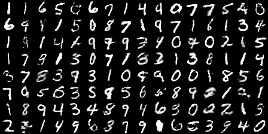
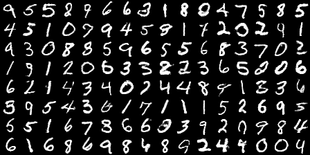

### Introduction

Target of this work was to implement WGAN-GP
([see 1704.00028](https://arxiv.org/pdf/1704.00028.pdf)). Work was
partly based on "official" WGAN-GP implementation
(https://github.com/igul222/improved_wgan_training)

### Experiments on MNIST

* 17_sdence_z128_mnist_lr1e-3 .  Both generator and discriminator (in orginal article is called critic) have two fully connected hidden layers with 1024 units each.

* 18_originfoarch_mnist_lr1e-3  . Architecture of MNIST test from Info-GAN article (see [table 1](https://arxiv.org/pdf/1606.03657.pdf)). But we remove all batch-normalization layers (see remarks)

### Important Remarks

* In these experiments RMSProp optimizer is used, because I found that in
some cases it is more stable than ADAM (in the case of CUHK03
dataset). 

* I use quite high learning rate (1e-3).  In case of unstable training,
you should consider to decrease learning rate. 

* Batch Normalization cannot be used in discriminator (see WGAN-GP
article). However you can use another types of normalization such
layer normalization.

